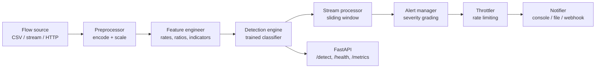

# NIDS-ML — Network Intrusion Detection and Alert System


A machine learning system that monitors network traffic, classifies each flow as benign or
malicious, and raises severity-graded alerts in real time over console, file and webhook channels.

Multiclass detection covers the four classic attack families — denial of service, probing, remote
to local and user to root — alongside normal traffic.

## Architecture



Full component detail is in [docs/ARCHITECTURE.md](docs/ARCHITECTURE.md); step-by-step operating
instructions are in [docs/USAGE.md](docs/USAGE.md).

## Installation

```bash
python3 -m venv .venv && source .venv/bin/activate
```

```bash
pip install -r requirements.txt
```

On macOS, XGBoost needs the OpenMP runtime (`brew install libomp`). Without it the pipeline logs a
warning and trains the remaining models.

## Quick start

Prepare a dataset (downloads a capture if you pass `--url`, otherwise synthesises 50,000 labelled
flows):

```bash
python scripts/download_data.py --rows 50000
```

Train, evaluate and register the best model:

```bash
python scripts/run_pipeline.py --rows 50000
```

Serve the detection API:

```bash
uvicorn src.api.main:app --host 0.0.0.0 --port 8000
```

Interactive documentation is then available at `http://localhost:8000/docs`.

## API

| Method | Path             | Purpose                                            |
| ------ | ---------------- | -------------------------------------------------- |
| POST   | `/detect`        | Classify a single flow and alert if malicious       |
| POST   | `/detect/batch`  | Classify up to 5,000 flows through the stream buffer |
| GET    | `/detect/stats`  | Rolling detection counters and recent alerts        |
| GET    | `/health`        | Service status and the model currently served       |
| GET    | `/metrics`       | Prometheus-style counters                           |

With the API running, the quickest way to see it work is to replay real labelled flows through it:

```bash
python scripts/demo_detect.py --per-class 3
```

```
TRUE    PREDICTED   CONFIDENCE   SEVERITY   RESULT
dos     dos         1.0000       CRITICAL   correct
normal  normal      1.0000       -          correct
probe   probe       0.9999       CRITICAL   correct
r2l     r2l         0.9998       CRITICAL   correct
u2r     u2r         0.9968       CRITICAL   correct
```

Absent fields are filled with the values learned during training, and the response reports how many
were substituted via `defaulted_features`. Treat a non-zero count as a warning: the error-rate and
connection-count features carry most of the discriminative signal, so a sparse flow will usually be
classified as normal regardless of intent. Send complete flow records for meaningful verdicts.

## Dataset

The system reads KDD/NSL-KDD style flow records: 41 connection features spanning basic properties
(`duration`, `protocol_type`, `service`, `flag`, byte counts), content indicators
(`num_failed_logins`, `root_shell`, `num_compromised`) and traffic statistics (`count`,
`serror_rate`, `dst_host_srv_diff_host_rate`, …).

When no capture is supplied, `src/data/loader.py` synthesises a labelled dataset whose
class-conditional distributions follow the behaviour of each family: denial of service produces high
`count` with saturated `serror_rate`, probes scan many services with high `rerror_rate` and low
`same_srv_rate`, remote-to-local shows failed logins and guest sessions, and user-to-root shows root
shells and file creation. The default mix is 53% normal, 30% dos, 11% probe, 5% r2l, 1% u2r.

## Model performance

Trained on 50,000 flows (70/15/15 stratified split), 30 features selected by mutual information.

| Model               | CV F1 (macro)   | Validation F1 | Training time |
| ------------------- | --------------- | ------------- | ------------- |
| XGBoost             | 0.9883 ± 0.0030 | 0.9934        | 3.3 s         |
| Random Forest       | 0.9829 ± 0.0062 | 0.9844        | 5.4 s         |
| Logistic Regression | 0.9822 ± 0.0042 | 0.9831        | 1.3 s         |

Held-out test set, XGBoost: accuracy 0.9993, macro precision 0.9966, macro recall 0.9952,
macro F1 0.9959, AUC-ROC 1.0000. Detailed analysis and limitations are in
[docs/MODEL_REPORT.md](docs/MODEL_REPORT.md).

## Project layout

```
src/data/         loading, cleaning, encoding, splitting
src/features/     engineered features and selection
src/models/       training, evaluation, versioned registry
src/detection/    inference engine and stream processor
src/alerting/     severity grading, throttling, delivery
src/api/          FastAPI application and routers
src/utils/        configuration, logging, validation
scripts/          data preparation, training, evaluation, notebook build
notebooks/        exploratory data analysis
tests/            pytest suite
```

## Configuration

All behaviour is driven by `config/config.yaml`: split ratios, feature selection method, model
hyperparameters, the detection confidence threshold, severity thresholds, alert channels and the
API bind address. Any value can be overridden per environment, for example:

```bash
NIDS_API__PORT=9000 NIDS_DETECTION__CONFIDENCE_THRESHOLD=0.85 uvicorn src.api.main:app
```

## Development

```bash
pytest --cov=src --cov-report=term-missing
```

```bash
python scripts/evaluate_model.py --dataset data/raw/flows.csv
```

Rebuild and execute the EDA notebook:

```bash
python scripts/make_notebook.py && jupyter nbconvert --to notebook --execute --inplace notebooks/01_eda.ipynb
```

Code style is PEP 8 with a 100 character line length, black-compatible. Contributions should keep
every module independently testable, add tests alongside behaviour, and use the shared loguru logger
rather than `print`.

## License

MIT.
