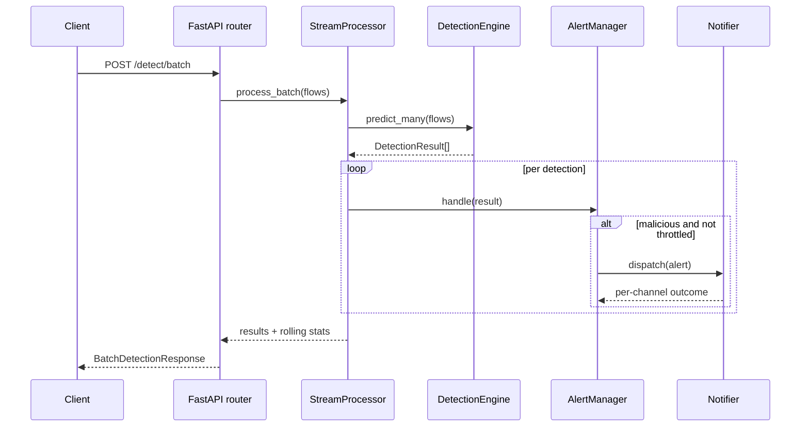

# Architecture

## Overview

NIDS-ML is organised as seven layers with one direction of dependency: utilities are used by
everything, and no lower layer imports a higher one. Training and serving share the same data and
feature code, so a flow is transformed identically whether it arrives from a CSV during training or
from an HTTP request in production.

```
utils  <-  data  <-  features  <-  models  <-  detection  <-  alerting  <-  api
```

## Components

### `src/utils`

`config.py` loads `config/config.yaml` into typed dataclasses and applies `NIDS_<SECTION>__<KEY>`
environment overrides. `logger.py` configures loguru with a colourised console sink plus rotating
`app.log` and `errors.log` files, guarding against duplicate sinks on repeated imports.
`validators.py` centralises the checks that every layer performs — frame shape, target sanity, path
existence, ratio bounds, flow completeness — and raises a single `ValidationError` type that the API
maps to HTTP 422.

### `src/data`

`loader.py` reads CSV or Parquet captures and, when none is available, synthesises a labelled
dataset from per-class feature profiles. `preprocessor.py` implements `FlowPreprocessor`: median
imputation for numeric columns, one-hot encoding with an explicit `__unknown__` bucket for unseen
categories, standard or min-max scaling, and label encoding of the target. The fitted object is
serialised into the model bundle so serving never rebuilds the schema by hand. `splitter.py`
produces a stratified 70/15/15 split, degrading to a random split when a class is too rare.

### `src/features`

`engineer.py` derives byte and packet rates, byte ratios, duration bands, error-rate totals,
privilege-activity indicators and inter-arrival approximations. Each step only fires when its source
columns exist, so partial inputs remain valid. `selector.py` prunes correlated columns, then ranks
the remainder by mutual information, model importance, RFE or absolute correlation, and persists the
chosen names to JSON so training and inference agree.

### `src/models`

`trainer.py` trains Random Forest, XGBoost, Logistic Regression and a linear SVM candidate with
stratified k-fold cross-validation and optional grid search; a failed candidate is logged and
skipped rather than aborting the run. `evaluator.py` computes accuracy, macro and weighted
precision/recall/F1, one-vs-rest AUC-ROC, the confusion matrix and the classification report, and
writes confusion-matrix, ROC and feature-importance plots. `registry.py` stores each model as a
`ModelBundle` (estimator + metadata + preprocessor) under a timestamped version, mirrors the winner
to `models/best_model.pkl`, and writes a sidecar metadata JSON.

### `src/detection`

`engine.py` loads a bundle and turns raw flows into `DetectionResult` objects: engineer, transform,
reindex to the model's feature order, predict, and attach class probabilities. A flow is flagged as
an attack only when the predicted class is non-benign *and* confidence clears the configured
threshold. `stream_processor.py` consumes an iterable of flows in batches, keeps a bounded deque of
recent results for trend statistics, and invokes a callback per detection — the hook the alerting
layer attaches to.

### `src/alerting`

`alert_manager.py` maps confidence to LOW/MEDIUM/HIGH/CRITICAL, escalating one level for privilege
escalation families (`u2r`, `r2l`) whose impact outweighs their confidence, and enriches the alert
with an identifier, timestamp and flow summary. `throttler.py` applies a sliding-window rate limit
keyed by attack type and severity. `notifier.py` fans alerts out to console, JSON-lines file,
webhook and SMTP channels; a failing channel is counted and logged but never blocks the others.

### `src/api`

`state.py` holds the process-wide engine, stream processor and alert manager, built once by the
FastAPI lifespan handler. If no model file exists the service still starts and reports `degraded`
health rather than crashing. `routers/detection.py` exposes `/detect`, `/detect/batch` and
`/detect/stats`; `routers/health.py` exposes `/health` and `/metrics`. `main.py` wires CORS,
exception handlers and the routers together.

## Data flow

### Training

```
raw capture ──> clean_dataset ──> engineer_features ──> FlowPreprocessor.fit_transform
      ──> select_features ──> split_dataset ──> ModelTrainer.train_all
      ──> evaluate_model (validation) ──> best model ──> evaluate_model (test)
      ──> ModelRegistry.save(as_best=True)
```

Artefacts: `models/best_model.pkl`, `models/<name>_<version>.pkl` with metadata JSON,
`data/processed/preprocessor.pkl`, `data/processed/selected_features.json`, and plots plus
`pipeline_summary.json` under `reports/`.

### Detection

```
flow ──> FlowInput validation ──> engineer_features ──> preprocessor.transform_features
     ──> reindex to model features ──> estimator.predict + predict_proba
     ──> DetectionResult ──> StreamProcessor buffer ──> AlertManager.handle
     ──> severity grading ──> throttle check ──> Notifier.dispatch
```

## Component interaction



## Design decisions

**The preprocessor travels with the model.** Serving skew is the most common failure mode in
deployed detectors, so the fitted transformer is stored inside the bundle instead of being
reconstructed from configuration at load time.

**Detection is decoupled from alerting.** The engine returns results; the stream processor decides
what to keep; the alert manager decides what is worth telling someone. Each can be tested and
replaced on its own.

**Failures degrade rather than cascade.** A missing model yields a degraded service, an unavailable
XGBoost build is skipped, and a dead webhook does not stop console and file delivery.

**Throttling is part of the design, not an add-on.** A detector that fires on every packet of a
flood is unusable; the sliding window bounds alert volume per attack type and severity while still
counting what was suppressed.

## Extension points

- **New model**: add a branch to `build_estimator` and an entry under `models:` in the config.
- **New feature**: add a vectorised `add_*` function in `engineer.py` and register it in the chain.
- **New alert channel**: subclass `Channel`, implement `send`, and wire it into `build_notifier`.
- **Live capture**: feed `StreamProcessor.process_stream` from a packet-capture generator that emits
  the same flow dictionaries.
